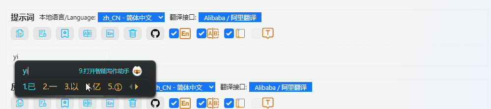
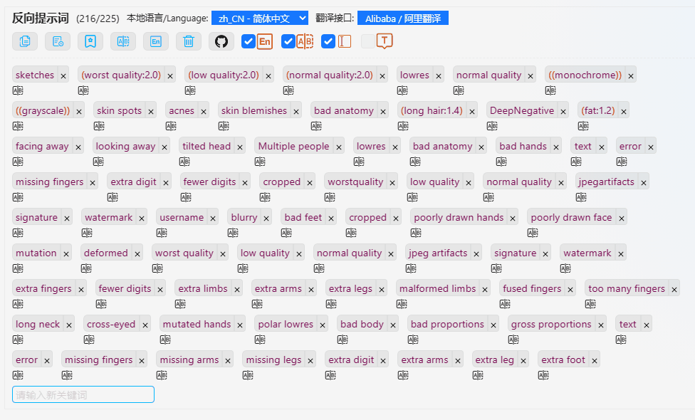
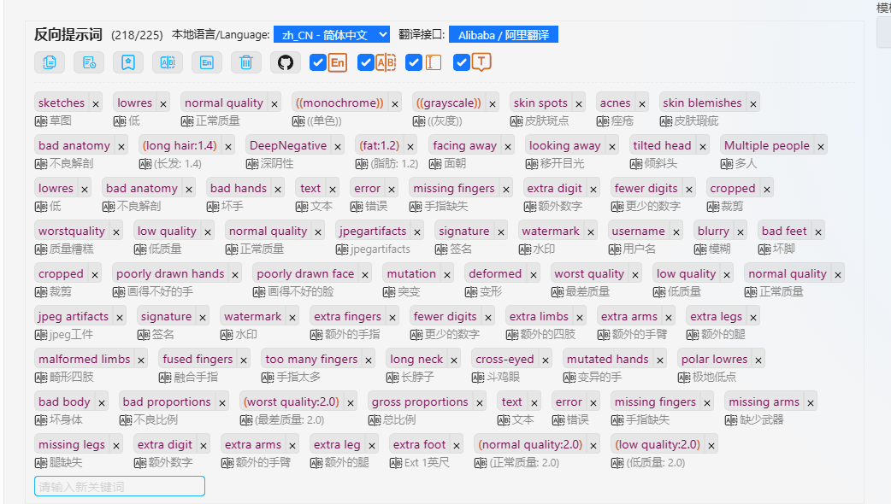
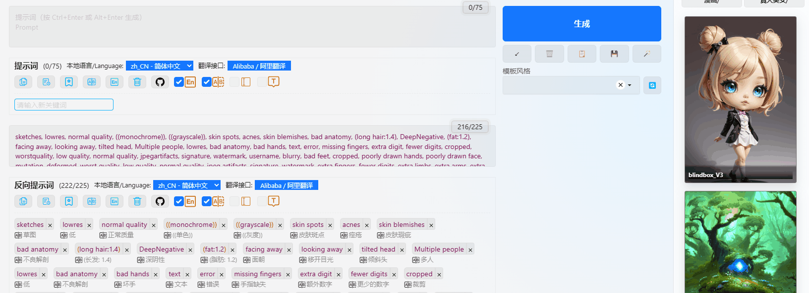
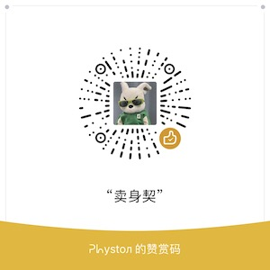

# sd-webui-prompt-all-in-one

------------

sd-webui-prompt-all-in-one is an extension based on stable-diffusion-webui that aims to improve the user experience of the prompt/negative prompt input box. It has a more intuitive and powerful input interface, provides automatic translation, history and collection functions, and supports multiple languages to meet the needs of different users.

*sd-webui-prompt-all-in-one 是一个基于 stable-diffusion-webui
的扩展，旨在提高提示词/反向提示词输入框的使用体验。它拥有更直观、强大的输入界面功能，它提供了自动翻译、历史记录和收藏等功能，它支持多种语言，满足不同用户的需求。*

> If you find this extension helpful, please give me a star on Github!
> You could also buy me a coffee: [donate](#donate)

> 如果你觉得这个扩展有帮助，请在Github上给我一颗星！
> 你也可以请我喝杯咖啡: [donate](#donate)

## Installation and Usage / *安装使用*

------------

### Method 1 (Recommended) / *方式一（推荐）*： 

1. Open the terminal and enter your stable-diffusion-webui directory.

    *打开终端，进入到你的 stable-diffusion-webui 目录下。*

    For example / *例如*：
   
    `cd "C:\stable-diffusion-webui"`


2. Use git to clone sd-webui-prompt-all-in-one to the extensions directory of stable-diffusion-webui.

    *使用 git 克隆 sd-webui-prompt-all-in-one 到 stable-diffusion-webui 的 extensions 目录下。*

    ```shell
    git clone "https://github.com/Physton/sd-webui-prompt-all-in-one.git" extensions/sd-webui-prompt-all-in-one
    ```

3. Restart stable-diffusion-webui.

   *重启 stable-diffusion-webui。*

### Method 2 / *方式二*：
1. Download the source code package of [sd-webui-prompt-all-in-one](https://github.com/physton/sd-webui-prompt-all-in-one/releases), and unzip it to the extensions directory of stable-diffusion-webui.

    *下载 [sd-webui-prompt-all-in-one](https://github.com/physton/sd-webui-prompt-all-in-one/releases) 的源码压缩包，解压到 stable-diffusion-webui 的 extensions 目录下。*


2. Restart stable-diffusion-webui.

   *重启 stable-diffusion-webui。*

## Features / *功能特性*

------------

- More intuitive and powerful prompt input interface: supports adding new keywords with one click, drag and drop sorting, one-click copying and one-click translation. At the same time, the interface can display the translation results of English<->local language intuitively.

    *更直观、强大的 prompt 输入界面：支持回车添加新关键词、拖动排序、一键复制和一键翻译。同时，界面中能够直观地显示英文<->本地语言的翻译结果。*

- Automatic translation: automatically translate the local language into English, and translate the English input of the prompt into the local language at the same time.

    *自动翻译：自动将本地语言翻译成英文，同时将 prompt 输入的英文翻译成本地语言。*

- History and collection: support recording the history and collection of the prompt, making it convenient for users to quickly search and use.

    *历史记录和收藏：支持记录 prompt 的历史记录和收藏，方便用户快速查找和使用。*

- Multi-language support: currently supports Simplified Chinese, Traditional Chinese, English, Russian, Japanese, Korean, French, German, Spanish, Portuguese, Italian, and Spanish, meeting the needs of different users.

    *多国语言支持：目前支持简体中文、繁体中文、英文、俄语、日语、韩语、法语、德语、西班牙语、葡萄牙语、意大利语、西班牙语，满足不同用户的需求。*

## Demo / *演示*

------------

- Automatic translation / *自动翻译*

  

- One-click translation / *一键翻译*

  

- Feature 1 / *特性1*

  

- Feature 2 / *特性2*

  


## Contributing / *帮助开发*

------------

If you want to contribute to sd-webui-prompt-all-in-one, welcome to submit issues and pull requests. You can also
contact me via:

*如果你想为 sd-webui-prompt-all-in-one 做出贡献，欢迎提交 issue 和 pull request。同时，你也可以通过以下方式联系我：*

- Email / *邮箱*：physton@163.com
- Wechat / *微信*：physton8
- QQ群：820700336

------------

## Development / *开发方式*

- Front-end development (vue) / *前端开发（vue）*
  1. Enter the src directory / *进入 src 目录*：
     
        `cd ./sd-webui-prompt-all-in-one/src`
  
  2. Initialize the node environment / *初始化node环境*：
  
        `npm install`

  3. Modify the code / *修改代码*
  4. Compile / *编译*：
  
        `npm run build`
  
  5. Restart stable-diffusion-webui / *重启 stable-diffusion-webui。*

- Back-end development (python) / *后端开发（python）*
  1. Enter the extension directory / *进入扩展目录*：`cd ./sd-webui-prompt-all-in-one`
  2. Modify the code / *修改代码*
  3. Restart stable-diffusion-webui / *重启 stable-diffusion-webui。*

------------

## Future / *未来计划*

- Support more languages / *支持更多的语言*
- Optimize translation services / *优化翻译服务*
- More powerful history function / *更强大的历史记录功能*
- ......

------------

## FAQ / *常见问题列表*

### Q: What languages does sd-webui-prompt-all-in-one support?

A: sd-webui-prompt-all-in-one supports multiple languages, including Simplified Chinese, Traditional Chinese, English, Russian, Japanese, Korean, French, German, Spanish, Portuguese, Italian, and Spanish.

### Q: What is the difference between translation interfaces that do not require API keys and those that require API keys?

A: The translation interface that does not require an API key is obtained through crawling and does not require the user to apply for an API key. However, there may be translation failures, instability, slow speed, and lack of support for concurrency. The translation interface that requires an API key calls the API interface of a third-party translation service and requires the user to apply for an API key. However, the translation success rate is relatively high, some interfaces support high concurrency, and the translation speed is fast.

### Q: sd-webui-prompt-all-in-one 支持哪些语言？

A: sd-webui-prompt-all-in-one 支持多种语言，包括简体中文、繁体中文、英文、俄语、日语、韩语、法语、德语、西班牙语、葡萄牙语、意大利语、西班牙语。

### Q: 无需api key的翻译接口和需要api key的翻译接口有什么区别？

A: 无需api key的翻译接口，是通过爬虫获取的，不需要用户自己申请api key，但是可能会存在翻译失败的情况，稳定下差，速度慢，不支持并发。需要api key的翻译接口，是通过调用第三方翻译服务的api接口，需要用户自己申请api key，但是翻译成功率较高，某些接口支持高并发，翻译速度快。

## Donate

------------

### Buy me a coffee / *请我喝杯咖啡*

#### Click / *点击* 👉 [](https://liberapay.com/physton/donate)

#### BTC-Bitcoin `3LdXwHkkVsspQzgowdy3pymwty9LiFBHda`

#### ETH-Ethereum `3DbapbGRQdbrDqBazBPYWfyKjbM5uN2SDy`

#### USDT-ERC20 `0xb8b7a067c5639e7befb9665be9bd00a4c75b6614`

#### USDT-TRC20 `TWtnKQgSTpHu1eiQGrppSniGyzYtggZYFf`

#### Paypal `physton@163.com`

#### Alipay / 支付宝 `physton@163.com`

#### Wechat / 微信赞赏 



Developed by: https://www.physton.com